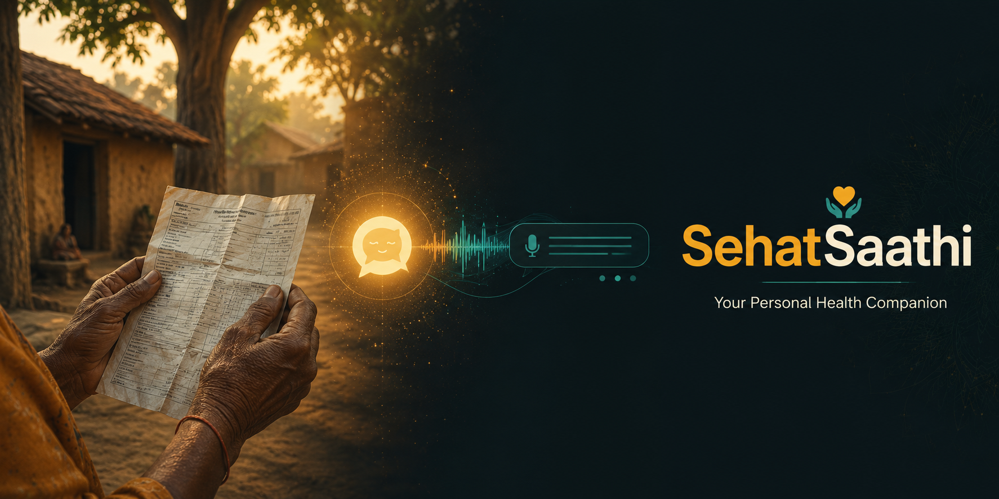

# SehatSaathi — Your Personal Health Companion

> *"Sehat" means health. "Saathi" means companion. Together, a friend who helps you understand your health.*

---

## The Problem

A farmer in rural Madhya Pradesh visits a government hospital. The doctor hands him a report — blood work, a diagnosis, maybe a referral. He cannot read it. His wife cannot read it. The nearest educated person who might help is three villages away.

He goes home not knowing if he is seriously ill or just mildly unwell. He does not know if he needs to act today or can wait a week. Fear fills the gap where information should be.

This is not an exception. This is the everyday reality for hundreds of millions of Indians.

**India has 1 doctor for every 1,511 people.** In rural areas, that ratio is far worse. Most people in villages interact with the healthcare system once — when something goes wrong — and walk away more confused than when they came in.

Medical documents are written for doctors, not patients. And when patients cannot understand what is wrong with them, they cannot take care of themselves.

---

## What SehatSaathi Does

SehatSaathi is an AI-powered health companion built specifically for rural India.

You take a photo of your medical report. SehatSaathi reads it, understands it, and explains it to you — in your language, in simple words, the way a caring and knowledgeable neighbor would.

Then it talks to you. A voice agent — speaking Hindi, Marathi, Bengali, Tamil, or English — walks you through your report, answers your questions, and tells you exactly what your next step should be.

Not as a doctor. As a companion.

It never tells you what medicine to take. It never confirms or denies a diagnosis. It simply helps you understand what your body is going through and whether you need to see a doctor urgently or can manage with rest and care.

If something in the conversation suggests you are in danger, it quietly alerts your doctor or emergency contact — while keeping you calm.

---

## Who This Is For

- A mother in a village who cannot read her child's blood report
- An elderly farmer who does not understand why the doctor prescribed what he did
- A first-generation family navigating the healthcare system for the first time
- Anyone who has ever walked out of a clinic holding a piece of paper they could not understand

---

## The Guardrails

SehatSaathi is built with strict safety boundaries.

It will never name a medicine. It will never confirm you have a disease. It will never give you a dosage or a treatment plan. These decisions belong to doctors.

What it will always do is point you toward the right care, explain things clearly, and make sure you never feel alone when facing a scary report.

---

## Languages Supported

Hindi · English · Marathi · Bengali · Tamil

---

## Built & Maintained By

**[Manish Dash Sharma](https://www.manishdashsharma.com/)** — Senior Software Engineer

*Architecting AI-powered systems that scale. From GenAI integrations to full-stack solutions — turning complex problems into elegant code.*

---

*SehatSaathi is not a substitute for professional medical advice. It is a bridge — between a confusing document and the confidence to seek the right help.*
